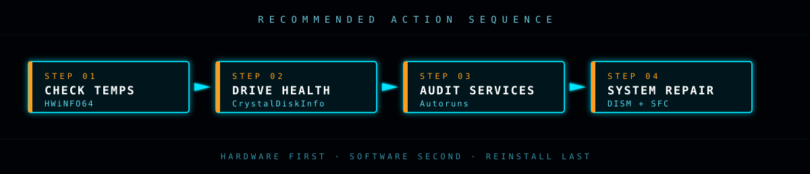

<div align="center">

</div>

Four steps, in order. Each one answers a question, and each answer decides whether you continue or stop and fix something.

The ordering is deliberate: **hardware first, software second, reinstall last.** Steps 1 and 2 cost about five minutes combined and can save you an entire wasted evening of tuning a machine that needs a part.

[← Toolkit](TOOLKIT.md) · [Fixes →](FIXES.md) · [README](README.md)

<div align="center">

</div>


## Step 01 — CPU temperatures

**Tool:** [HWiNFO64](https://www.hwinfo.com/download/) · **Time:** 5 minutes · **Answers:** is the cooling working?

Launch HWiNFO64 in **Sensors-only** mode and find the AMD Ryzen 5 5600X block. The reading that matters is **CPU (Tctl/Tdie)**. Let the machine sit completely idle for five minutes, then read it.

| Idle temperature | Verdict |
|:-----------------|:--------|
| **30–45 °C** | Normal. Cooling is fine — move to Step 2. |
| **45–70 °C** | Elevated. Worth cleaning dust, but probably not your main problem. |
| **70–80 °C+** | **This is your problem.** A 5600X should never idle here. → [FIXES: Thermals](FIXES.md#thermals) |

While you're in there, check two more things:

- **Fan speeds.** A CPU fan reading `0 RPM` while temperatures climb means a dead fan or a dead AIO pump. That's a hardware replacement, not a settings change.
- **The Maximum column.** Reset it, then load the machine for a minute. If Maximum hits 95 °C the CPU is throttling, and everything about the system will feel slow regardless of what else you fix.

> [!NOTE]
> A 5600X *briefly* touching 80–90 °C under heavy sustained load isn't automatically a fault — these chips are designed to boost until they run out of thermal headroom. The alarming signal is a **high idle temperature**, or hitting 95 °C within seconds of any load at all.


## Step 02 — Drive health

**Tool:** [CrystalDiskInfo](https://crystalmark.info/en/download/) · **Time:** 2 minutes · **Answers:** is the drive dying?

Run it. The **Health Status** block at the top left gives you the verdict immediately.

| Status | Meaning | Action |
|:-------|:--------|:-------|
| 🟦 **Good** | No reallocations, error rates within spec | Continue to Step 3 |
| 🟨 **Caution** | Degradation detected and progressing | **Back up now.** Plan to replace the drive. |
| 🟥 **Bad** | Failure imminent or in progress | **Stop. Back up immediately.** Nothing else matters. |

### The attributes that actually matter

Ignore most of the list. These four are the ones that predict failure:

| Attribute | What it means |
|:----------|:--------------|
| **Reallocated Sectors Count** | Sectors that died and got remapped to spares. Should be `0`. Any non-zero value that is *growing* means the drive is actively failing. |
| **Current Pending Sector Count** | Sectors flagged as unstable, awaiting remap. Non-zero here is what produces freezes — the drive retries the read, and Windows waits. |
| **Uncorrectable Sector Count** | Reads that failed outright and could not be recovered. Data has already been lost. |
| **Percentage Used** *(NVMe)* | Wear level. Above 90% the drive is near its rated endurance. |

Also glance at **Temperature** (an NVMe above 70 °C is throttling itself) and **Power On Hours** (context for how much life is reasonable to expect).

### Optional: confirm with a benchmark

If health reads `Good` but the machine still feels sluggish on disk, run [CrystalDiskMark](https://crystalmark.info/en/download/) and compare sequential read/write against the drive's rated speed. A NVMe SSD delivering a few hundred MB/s instead of a few thousand is failing in a way S.M.A.R.T. doesn't report.

> [!WARNING]
> If Step 2 comes back `Caution` or `Bad`, **stop the entire process here.** Copy your data off, replace the drive, reinstall Windows. Continuing to troubleshoot software on a failing drive wastes your time and risks your files.


## Step 03 — Audit startup and services

**Tools:** [Autoruns](https://learn.microsoft.com/en-us/sysinternals/downloads/autoruns), [AdwCleaner](https://www.malwarebytes.com/adwcleaner) · **Time:** 20 minutes · **Answers:** what's actually running?

Hardware is clear. Now find the software eating the machine.

### Autoruns

Run it as Administrator, then **immediately** enable `Options → Hide Microsoft Entries`. This removes the ~80% of the list that is Windows itself and leaves only third-party code.

Work these tabs in order:

1. **Logon** — programs that start with your session. Anything you don't recognize and didn't install deliberately is a candidate.
2. **Services** — background services. This is where the Dell and Alienware entries live; see [FIXES](FIXES.md#dell-and-alienware-services).
3. **Scheduled Tasks** — the tab people forget. Updaters and telemetry agents hide here specifically because Task Manager's Startup tab doesn't show them.
4. **Drivers** — boot-time drivers. Be conservative; a wrong disable here can leave the machine unbootable.

**Uncheck to disable — do not delete.** Unchecking is reversible; deleting the entry is not. Disable in small batches, reboot, and see whether the problem changed. Disabling twenty things at once tells you nothing about which one mattered.

Yellow rows mean the file the entry points at is missing (harmless leftovers, safe to clear). Right-click → **Search Online** identifies anything unfamiliar.

### AdwCleaner

Run a scan. It takes a few minutes and finds the adware, PUPs and browser hijackers that antivirus deliberately skips. **Review the results before accepting** — it's aggressive and occasionally flags legitimate software. It'll want a reboot to finish.


## Step 04 — System file integrity

**Tools:** Built into Windows · **Time:** 30–45 minutes · **Answers:** is Windows itself damaged?

Open **Command Prompt as Administrator** and run these **in this order** — DISM repairs the component store that SFC pulls its replacement files *from*, so running SFC first on a damaged store just fails and wastes half an hour.

```dos
DISM.exe /Online /Cleanup-image /Restorehealth
sfc /scannow
```

**DISM** contacts Windows Update to repair the component store. It can appear frozen at 20% for a long stretch — this is normal, let it run.

**SFC** then scans every protected system file and replaces the corrupted ones from the store DISM just repaired.

### Reading the output

| Result | Meaning |
|:-------|:--------|
| `did not find any integrity violations` | Windows is intact. Not your problem. |
| `found corrupt files and successfully repaired them` | Fixed. **Reboot, then re-run `sfc /scannow`** to confirm it's clean. |
| `found corrupt files but was unable to fix some` | Deeper damage. Run the offline route below. |

### If SFC can't repair

Boot the [Windows 11 ISO](https://www.microsoft.com/software-download/windows11) from Ventoy, then **Repair your computer → Troubleshoot → Command Prompt**, and run SFC against the offline installation:

```dos
sfc /scannow /offbootdir=C:\ /offwindir=C:\Windows
```

Verify your drive letter first with `diskpart` → `list volume` — **the letters in the recovery environment are frequently not the ones you see in Windows.**


## Optional — memory test

If the machine hangs randomly and Steps 1–4 all came back clean, RAM is the remaining hardware suspect. Boot [MemTest86](https://www.memtest86.com/download.htm) from Ventoy and let it run **at least four full passes** — realistically, overnight.

**A single error is a failure.** There is no acceptable error count. If it fails, pull one stick and retest to identify which of the two modules is bad.


## After the run

Re-measure. Idle temperature back in range, drive reporting `Good`, boot time reasonable, no single process pinning the CPU at idle — that's a fixed machine.

And if you disabled Secure Boot to boot the rescue media: **[turn it back on](FIXES.md#restore-secure-boot).**

<div align="center">

[← Toolkit](TOOLKIT.md) · [Fixes →](FIXES.md) · [README](README.md)

`END OF LINE`

</div>
