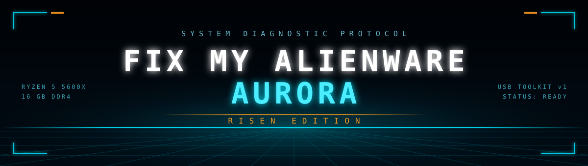

<div align="center">



<br>


<h3>A USB diagnostic and repair toolkit for an Alienware Aurora that stopped behaving.</h3>

<p><em>Greetings, program.</em> This repo is the field kit and the runbook — every tool that goes on the stick, and the exact order to run them in.</p>

</div>


## The problem this solves

The machine wasn't broken. It was *slow* — the specific kind of slow where nothing crashes, nothing errors, and every explanation sounds plausible. Alienware Auroras have a few well-known reasons for that:

- **Thermal headroom is thin.** The chassis is tight. A dying AIO pump or dried thermal paste puts a Ryzen 5 5600X at 95 °C and holds it there, and the CPU throttles itself into the ground rather than cook.
- **The boot drive fails quietly.** Reallocated sectors and read-error retries don't announce themselves. Windows just stops responding while it waits on I/O that never comes.
- **Dell ships a lot of software.** SupportAssist and Alienware Command Center are known to get stuck in disk and CPU utilization loops that Task Manager makes look normal.

The fix for all three starts the same way: **stop guessing and measure.** That's what the toolkit is for.


## Run order

<div align="center">

</div>

Work the sequence top to bottom and **do not skip ahead**. Steps 1 and 2 are hardware questions — if either comes back bad, no amount of software cleanup will fix the machine, and you'd be tuning a PC that needs a part replaced.

| # | Check | Tool | If it comes back bad |
|:--|:------|:-----|:---------------------|
| **01** | CPU temperature | HWiNFO64 | Idle above 70–80 °C → cooling problem. Stop here, go to [FIXES](FIXES.md#thermals) |
| **02** | Drive S.M.A.R.T. health | CrystalDiskInfo | Status `Caution` or `Bad` → **back up now**, the drive is failing |
| **03** | Startup & service load | Autoruns | Dell/SupportAssist services eating the CPU → [FIXES](FIXES.md#dell-and-alienware-services) |
| **04** | System file integrity | DISM + SFC | Corruption found → let it repair, reboot, re-measure |


## Documentation

| Document | What's in it |
|:---------|:-------------|
| **[TOOLKIT.md](TOOLKIT.md)** | All 10 tools, what each is for, and where to download it |
| **[DIAGNOSTICS.md](DIAGNOSTICS.md)** | The 4-step run in detail — what to click, what the numbers mean |
| **[FIXES.md](FIXES.md)** | The repairs themselves: thermals, Dell services, DISM/SFC, driver wipes |


## Building the stick

You need one USB drive, 32 GB or larger. [Ventoy](https://www.ventoy.net/en/download.html) is what makes this work — install it to the drive once, and after that you add bootable ISOs by **copying the files onto the drive like any other folder.** No reflashing between tools.

```
1. Install Ventoy to the USB drive        (erases it — use an empty one)
2. Copy your .iso files to the drive      (Hiren's, Windows 11, MemTest86)
3. Make a \Portable folder on the drive   (HWiNFO64, CrystalDiskInfo, Autoruns, etc.)
4. Boot the Aurora, tap F12, pick the USB
```

Ventoy shows a boot menu of every ISO on the drive. The portable `.exe` tools in `\Portable` run from inside Windows *or* from inside the Hiren's environment — no install needed either way.


> [!WARNING]
> **Back up first.** Step 2 exists because the drive might be dying. If it is, every minute spent troubleshooting is a minute gambling with your data. Copy anything irreplaceable to an external drive *before* you start.

> [!IMPORTANT]
> **Secure Boot.** Booting third-party rescue media usually means disabling Secure Boot in the BIOS. **Re-enable it when you're done.** Windows 11 depends on it for security updates and core services — leaving it off is a permanent downgrade in exchange for a temporary convenience.

> [!NOTE]
> **Every tool here is free** for personal use, and none require a license key. If a download page is asking for a credit card, you're on the wrong page — check the link against [TOOLKIT.md](TOOLKIT.md).


<div align="center">

**Disclaimer** — These are notes from fixing one specific machine. Changing BIOS settings, disabling services, and wiping drivers can leave a PC unbootable if done carelessly. Read before you run, and understand that you're the one holding the identity disc.

<sub>Not affiliated with Dell, Alienware, or the authors of any tool linked here. All trademarks belong to their owners.</sub>

<br>

`END OF LINE`

</div>
